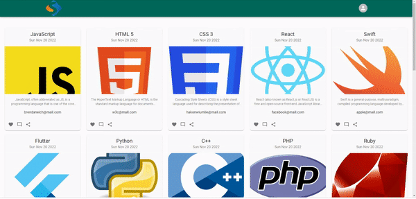

# blog app

## Table of contents

- [Overview](#overview)
  - [Description](#description)
  - [Project Skeleton](#project-skeleton)
  - [Screenshot](#screenshot)
  - [Links](#links)
- [My process](#my-process)
  - [Built with](#built-with)


## Overview

### Description

 In this project, it is aimed to create blog posts using firebase realtime-database and display them on the dashboard. Adding, deleting and updating blog posts can be done. In the project, firebase realtime-database library was used for storing data, material-ui library for styling, react-router library for page transitions, formik and yup libraries for form structure and validation, and react-toastify library for notifications. In addition, firebase was used for login and authorization processes.

### Project Skeleton

```
blog-app (folder)
       public(folder)
           |----index.html 
           |----logo.png
       src (folder)
           |----app.js 
           |----app.css 
           |----index.js
           |----index.css 
           assets (folder)
                |----blog.png
                |----google.png
                |----logo.png
           components (folder)
                |----BlogCard.jsx
                |----BlogForm.jsx
                |----Navbar.jsx
           contexts (folder)
                |----AuthContext.jsx
           helpers (folder)
                |----toastNotify.js
                |----firebase.js
           pages (folder)
                |----Dashboard.jsx
                |----Main.jsx
                |----Details.jsx
                |----Login.jsx
                |----NewBlog.jsx
                |----Profile.jsx
                |----Register.jsx
                |----UpdateBlog.jsx
           router (folder)
                |----AppRouter.jsx
                |----PrivateRouter.jsx
                
```

### Screenshot

<p align="center">
<a href="https://s-blog-app.vercel.app/"></a>
</p>


### Links

- Live: [Live Website](https://s-blog-app.vercel.app/)

## My Process

### Built with

- React.js
- Javascript
- Html5
- Css3
- Material UI
- Firebase
- Context API
- React Router
- Formik
- Yup
- React Toastify
- Responsive Design
